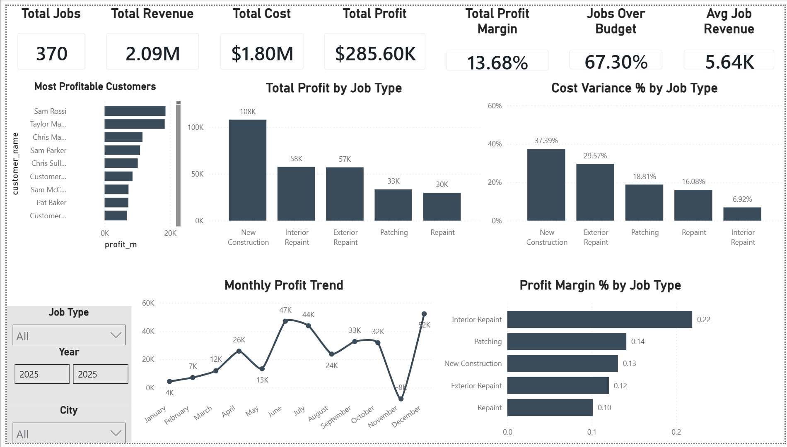

# Business Performance Analytics Dashboard

Power BI + Python project analyzing simulated job costing and profitability data.

This project demonstrates data cleaning, transformation, KPI modeling, and dashboard development for business performance tracking.

Note: All data in this project is simulated for portfolio/demo purposes.

---

## 📊 Dashboard Preview

---

## 🎯 Project Objective

The goal of this project is to analyze job-level revenue, cost, and profitability data to:

- Identify the most profitable job types and customers
- Track profit trends over time
- Monitor cost variance and budget performance
- Evaluate margin performance across service categories

This simulates a real-world business analytics use case for a service-based company.

---

## 🛠 Tools & Technologies

- Power BI (Data Modeling + Visualization)
- Python (Data transformation & preparation)
- Pandas
- CSV data structures
- Git & GitHub

---

## 📁 Project Structure
business-performance-analytics-dashboard/
│
├── data/
│ ├── jobs.csv
│ ├── job_costing_fact.csv
│ └── data_dictionary.csv
│
├── scripts/
│ └── cost_analysis.py
│
├── dashboard_preview.png
└── README.md
---

## 📈 Key Metrics Included

- Total Revenue
- Total Cost
- Total Profit
- Profit Margin %
- Cost Variance %
- Jobs Over Budget %
- Monthly Profit Trend
- Profit by Job Type
- Profit by Customer

---

## 🔎 Business Insights Demonstrated

- New Construction generates highest total profit but has highest cost variance.
- Interior Repaint shows strongest profit margin.
- Profit trends fluctuate seasonally, highlighting cash flow considerations.
- Certain customers contribute disproportionately to total profit.

---

## 🚀 How To Use

1. Review the CSV data in `/data`
2. Run Python scripts in `/scripts` if adjustments are needed
3. Open the `.pbix` file in Power BI Desktop to explore the dashboard interactively

---

## 📌 What This Project Demonstrates

- Data cleaning & preparation
- Financial KPI modeling
- Variance analysis
- Dashboard design for executive reporting
- Translating raw data into actionable insights
